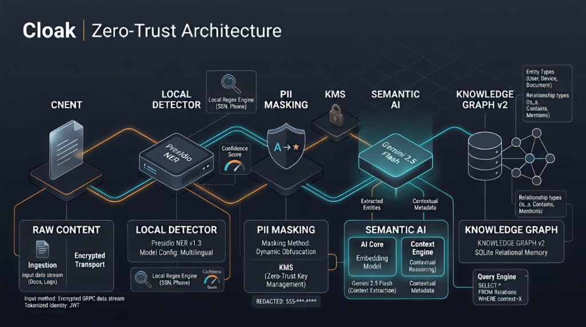

# 🛡️ Cloak: A Zero-Trust PII Redaction Platform

## 🚀 Architectural Design & Core Philosophy

**Cloak** is a privacy-first, zero-trust document anonymization platform. Unlike typical redaction tools that rely on black-box cloud APIs, Cloak implements a hybrid privacy architecture designed to prevent data leakage at the source while resolving the core human challenges of manual data sanitization.

---

## 🎯 Conceptual Foundations

### 1. Combating Automation Bias via Asymmetric Friction
Standard PII tools present all automated detections in a uniform list, creating a cognitive hazard known as **automation bias**—where human reviewers trust automated suggestions blindly and skim over missed leaks. 

Cloak counters this through **Asymmetric Friction UX**:
* **High-Exposure Alerts:** Critical items (e.g., SSNs, Passports) utilize dynamic visual pulses to maintain reviewer engagement.
* **Stage-and-Confirm Dismissals:** While routine approvals take one click, dismissing a high-exposure risk requires a staged confirm pathway. This cognitive speed bump forces reviewers to consciously acknowledge the risk of exposing sensitive data.
* **Risk-Framed Post-Mortems:** Upon export, reviewers are presented with a quantitative summary of remaining exposure metrics rather than generic "accuracy percentages," reinforcing a security-first posture.

---

## 🧠 Technical Architecture & Data Design

### 1. Hybrid Zero-Trust Data Pipeline
To enable deep semantic context analysis without compromising user data, Cloak implements a **local-first masking model**:
* **Local NER (Presidio + spaCy + Custom Rules):** Named Entity Recognition and custom regex rules process documents locally on the device to locate structured PII.
* **Local Anonymization Mask:** Before transmitting content to external cloud models (like Google Gemini), all high-confidence local entities are masked directly in the character array (e.g., replacing digits with `*`).
* **Semantic Analysis:** The cloud LLM receives a metadata-masked text payload, allowing it to perform deep semantic analysis to detect complex context-dependent leaks (e.g., descriptions of projects, relationships) without ever seeing the raw sensitive credentials.

### 2. Relational Knowledge Graph (KG) Memory
Cloak utilizes a persistent SQLite-backed relational knowledge graph to trace entity connections across multiple documents over time.

* **Automatic Relation Inference:** When a document is analyzed containing a single named individual and associated contact info (e.g., email or phone), the backend establishes a relational node link:
  $$\text{Name} \overset{\text{owns}}{\longleftrightarrow} \text{Email/Phone}$$
* **Cross-Document Memory Propagation:** In subsequent documents, if a previously mapped email appears in isolation, the KG matches the value, raises the detection confidence to maximum override, and displays the relationship trace directly in the reviewer tooltip.

### 3. Hierarchical Consensus Engine
Detections from local regex layers, local NER models, custom enterprise rules, the relational knowledge graph, and cloud semantic models are unified using a multi-pass consensus resolver.

* **Priority Ranking:** Conflicting spans are resolved by prioritizing:
  $$\text{Custom Rules} > \text{Knowledge Graph} > \text{NER Model} > \text{Regex Pattern}$$
* **Agreement Tracking:** Spans compile an agreement profile, mapping which layers flagged the entity. Reviewers can hover over any badge to inspect the exact detection footprint.

---

## 🔑 Demo Credentials

To test the pre-seeded databases and verify the zero-trust workflow:
* **Username:** `admin`
* **Password:** `password123`

---

  <b>Developed By</b> 
  Anaswara K 
  <code>CB.SC.U4CSE23405</code>  
  <i>Building the future of privacy, one document at a time.</i>

